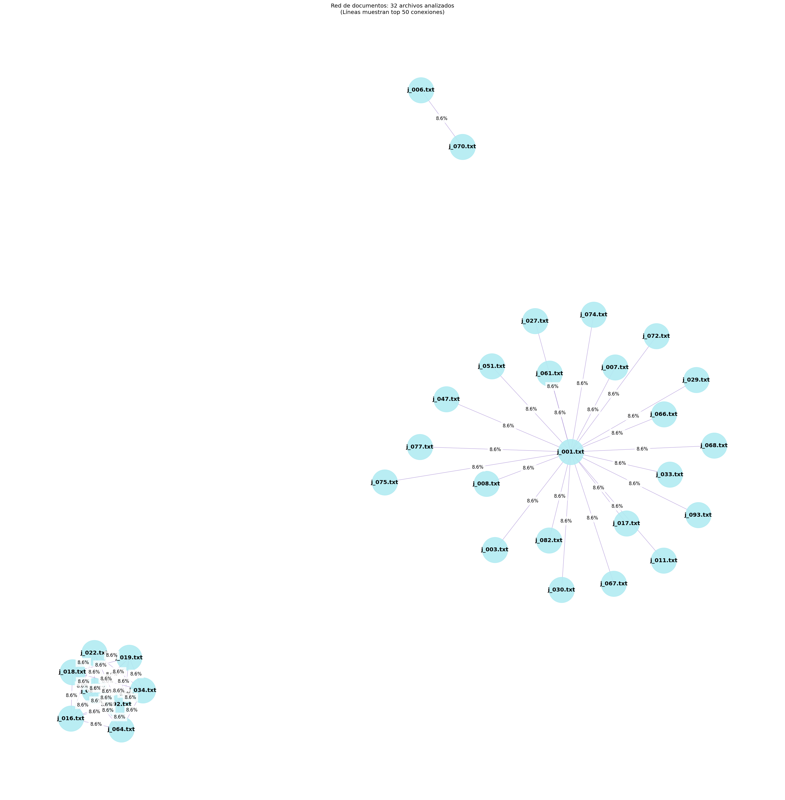

# Proyecto de Detección de Similitud entre Documentos

## Descripción general
El objetivo de este programa es comparar los documentos estudiantiles y detectar si hay plagio.
Este sistema utiliza tablas hash para almacenar y comparar los documentos según su similitud.
Este proyecto tokeniza documentos en n-gramas, utiliza funciones hash (y opcionalmente filtros de Bloom) para mapear los n-gramas, compara documentos utilizando la similitud de Jaccard y ordena los resultados con un algoritmo de ordenamiento (Merge Sort). Finalmente, muestra los N pares de documentos con mayor similitud.

## Instrucciones de instalación:
- git clone https://github.com/tu_usuario/proyecto-plagio.git
- cd proyecto-plagio
- Instalar lo
- Python 3.8 o superior
- Librerías necesarias:
  ```bash
- pip install matplotlib numpy mmh3
- python main.py

## Ejemplo de uso:
Al ejecutar el programa

1.- Se procesan 100 documentos .txt con información de videojuegos.
2.- Se tokeniza el contenido en n-gramas.
3.- Se calculan similitudes entre todos los pares de documentos.
4.- Se ordenan los resultados y se muestra en consola el Top.
5.- Se genera un grafo visual con las conexiones más relevantes.

## Estructura del Proyecto
- **main.py**: Archivo principal de ejecución.
- **src/**: Contiene módulos reutilizables:
  - `preprocessing.py`: Funciones de preprocesamiento de texto y generación de n-gramas.
  - `hash_utils.py`: Funciones hash personalizadas y comparación de documentos.
  - `sorting.py`: Implementación de Merge Sort y visualización de resultados.
  - `bloom_filter.py`: (Opcional) Implementación de un filtro de Bloom.
- **documentos/**: Carpeta donde se colocan los archivos .txt (trabajos estudiantiles).
- **resultados/**: Carpeta para guardar los resultados generados.
- **tests/**: Casos de prueba y archivos de validación.

## DETECTOR-PLAGIO
├── main.py 
├── src/ 
│ 
  ├── preprocessing.py # Tokenización, limpieza, generación de n-gramas 
  │ 
  ├── hash_utils.py # Funciones hash y comparación con Jaccard 
  │ 
  ├── sorting.py # Merge Sort y visualización textual 
  │ 
  ├── visualization.py # Grafo y gráfica de similitud 
  │ 
  └── bloom_filter.py # (Opcional) Filtro de Bloom 
├── ArchivosTXT_Videojuegos/ # Archivos generados automáticamente (100+ textos) 
├── resultados/ # Carpeta de salida para imágenes PNG 
├── tests/ # (Opcional) Archivos de prueba unitaria 
└── commits.png
└── README.md

## Resultado visual generado:
## ¿Cómo replicar los resultados?
- Se generan 100 archivos a partir de src/generador_archivos/generador_archivos.py 
- Ejecuta python src/detecArchivosTXT_Videojuegostor.py
- Los resultados aparecerán en consola, ordenados por similitud

## Para modificar el tamaño del n-grama o cantidad de resultados mostrados, edita estas variables en detector.py:
- ngram_size = 3
- top_n = 50

## Visualizaciones de los resultados
Actualmente, los resultados se muestran como tabla en consola. Se planea una futura versión con visualización gráfica tipo grafo usando networkx o matplotlib.

## Ejemplo visual esperado:
- Nodo = documento.txt(j_001, j_002, etc.)
- Arista = similitud > 0.5


## Historial de commits y progreso y colaboración de equipo


## Equipo 4
## Integrantes:
- Saul Alberto Ancona Martinez
- Erick Jael Guerra Canto
- Jessica Guadalupe Rodríguez Chim
- Diego Mauricio Zavaleta Osorio
